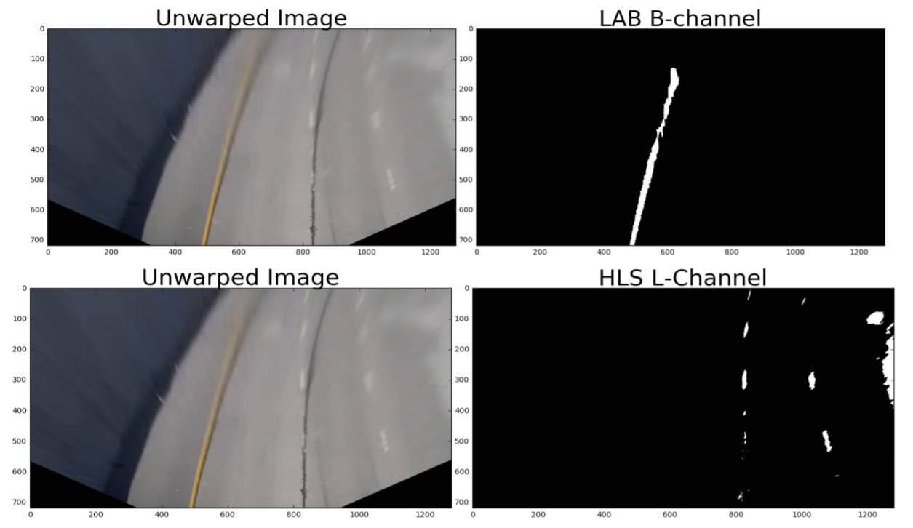
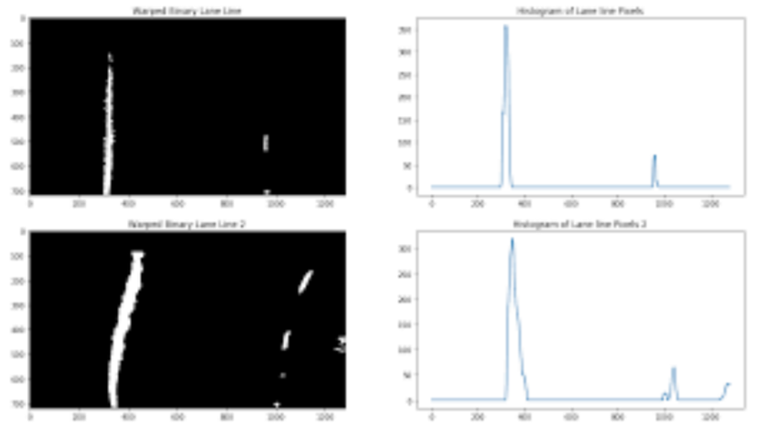
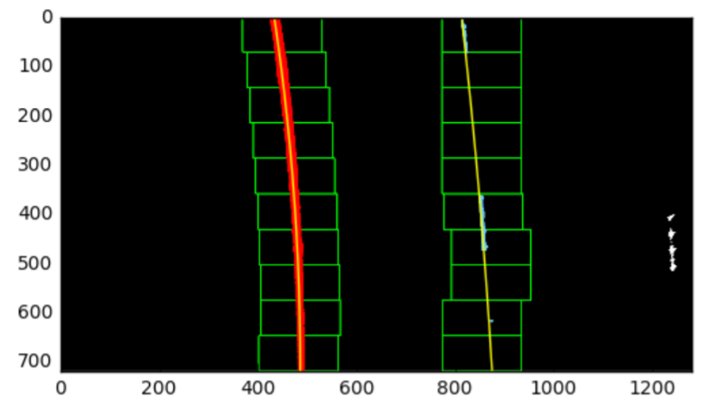
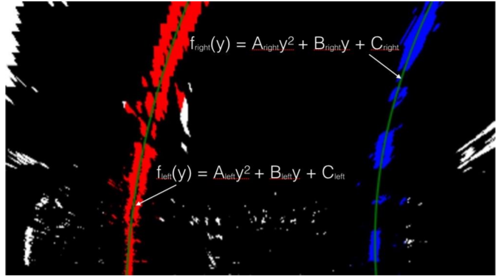
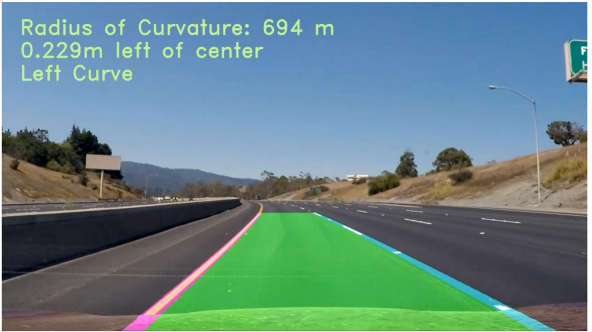

<h1 align=center> Advanced Lane Line Detection </h1>

<p align="center">


[](https://opensource.org/licenses/BSD-3-Clause)

## Overview
In this project we aim to do simple Lane Detection to mimic Lane Departure Warning systems used in Self Driving Cars.

## License
This project is under the [BSD License](https://github.com/krawal19/advance_lane_line_detection/blob/master/LICENSE).

## Dependencies
The ARTag detection and Tracking package requires following dependencies.
- Numpy
- Moviepy
- Python 3.5.4
- OpenCV 4.1.1 

## Operation
#### The pipeline for Lane Line Detection is as follows:
#### A) Warp image and Applying color transform
 1. To identify the lane properly I experimented with different color spaces. We plotted the image for
different channels, HSV color spaces channels, LAB channels and HLS channels.
2. Ultimately, we chose to use just the L channel of the HLS color space to isolate white lines and the B
channel of the LAB colorspace to isolate yellow lines. We did, however finely tune the threshold for
each channel to discard the shadow in the challenge video. Following is there outputs. (Credits: [Jeremy
Shanon](https://github.com/jeremy-shannon/CarND-Advanced-Lane-Lines))

3. The warp perspective is done for the following 
```
points.src=np.float32([(575,464),(707,464),(258,682),(1049,682)])
dst=np.float32([(450,0),(w-450,0),(450,h),(w-450,h)]). 
```
We then combine the above obtained images and pass itto the sliding window function

<p align="center">

</p>


#### B) Using Histogram and Kalman Filter for prediction
1. We first calculate the histogram of the lower half of the thresholded image obtained above since we use
to calculate the base points of the lane lines.
2. We then find then find the midpoint and quarter point of the image and use it to slice the histogram and
find the peaks in that using the argmax function of numpy.
3. These peaks are passed to the Kalman filter so that we can remove any noisy detection of lane and
prevent lane from expanding or contracting suddenly.


<p align="center">

</p>

#### C) Using Sliding window polyfit to find all lane pixels
1. After we get the two base points from above we use a sliding window of a preset size to appear at that
point.
2. This window checks the number of nonzero pixels in that window which are basically the number of pixels
corresponding to the lane.
3. If the number of pixels is greater then 40 then we consider it as a lane window and find the mean of all
the point location which will be the x of the next window.
4. Since we are using 10 sliding windows, we have divided the height of the image into 10 and those gives
us the y-coordinate.
5. Thus, the sliding window tracks the lane and gives following output. Finally we collect these pixels and
pass it to the next function to calculate the equation of the curve.

<p align="center">

</p>

#### D) Fitting the curve of the lane and Moving Average.
1. The points found in the previous function are separated into x and y coordinates separately.
2. Then we use the np.polyfit function to fit these points in a second degree polynomial and the function
gives us a, b and c values. The below image shows more clarity.
3. We then accumulate the last 5 a, b and c values and calculate the moving average with every new
incoming value and also remove the oldest values.

<p align="center">

</p>

#### E) Radius of curvature and Lane offset calculation
1. The radius of curvature is based upon this [website](https://www.intmath.com/applications-differentiation/8-radius-curvature.php) and in the below line of code.

<p align="center">
Rcurve=∣dy2d2x∣[1+(dydx)2]3/2
</p>

2. In the case of the second order polynomial above, the first and second derivatives are:
<p align="center">
f′(y)=dydx=2Ay+B

f′′(y)=dy2d2x=2A
</p>

3. So, our equation for radius of curvature becomes:
<p align="center">
Rcurve= ((1+(2Ay+B)^2)^3/2)/∣2A∣
</p>

4. Which in code looks like below.
```
curve_radius = ((1 + (2*fit[0]*y_0*y_meters_per_pixel + fit[1])**2)**1.5) / np.absolute(2*fit[0])
```
In this example, fit[0] is the first coefficient (the y-squared coefficient)of the second order polynomial fit, and fit[1] is the second (y) coefficient. y_0 is the y position within the image upon which the curvature
calculation is based (the bottom-most y - the position of the car in the image - was chosen). y_meters_per_pixel is the factor used for converting from pixels to meters. This conversion was also used to generate a new fit with coefficients in terms of meters.
5. The position of the vehicle with respect to the center of the lane is calculated with the following lines of
code:
```
lane_center_position = (r_fit_x_int + l_fit_x_int) /2
center_dist = (car_position - lane_center_position) * x_meters_per_pix
```
6. r_fit_x_int and l_fit_x_int are the x-intercepts of the right and left fits, respectively. This requires
evaluating the fit at the maximum y value (719, in this case - the bottom of the image) because the
minimum y value is at the top (otherwise, the constant coefficient of each fit would have sufficed). The
car position is the difference between these intercept points and the image midpoint (if the camera is
mounted at the center of the vehicle). (Credits: [Jeremy
Shanon](https://github.com/jeremy-shannon/CarND-Advanced-Lane-Lines))
Thus, we get the radius of curvature of the lane closer to the car.

#### F) Turn Direction Prediction
1. Initially we used the derivate of the polynomial of left curve closer to the car to calculate the turn
direction, but since that part doesn’t change much or doesn’t produce strong gradients we can’t predict
the road curvature direction accurately.
2. Thus, we used the farthest point on the left lane which we used to draw the lane, to find the slope
between it and a point in middle of the lane.
3. When the turn is left the gradient is positive due to the opposite convention of the image coordinate
system and is negative when the turn is right.
4. We then found that the left turn is strong if the gradient is between 1 to 25 and for right from -25 to -1
and for the rest values of gradients say that the lane is straight.

<p align="center">

</p>

## Instructions
Download the dependencies
Open the terminal in the same folder of the code and type below.
```
cd src
python LLD.py 
```
The output will be printed in the folder of the code. We have also provided sample outputs.
## Note
The above pipeline is developed specifically of the given videos under data folder and is not generalized.
